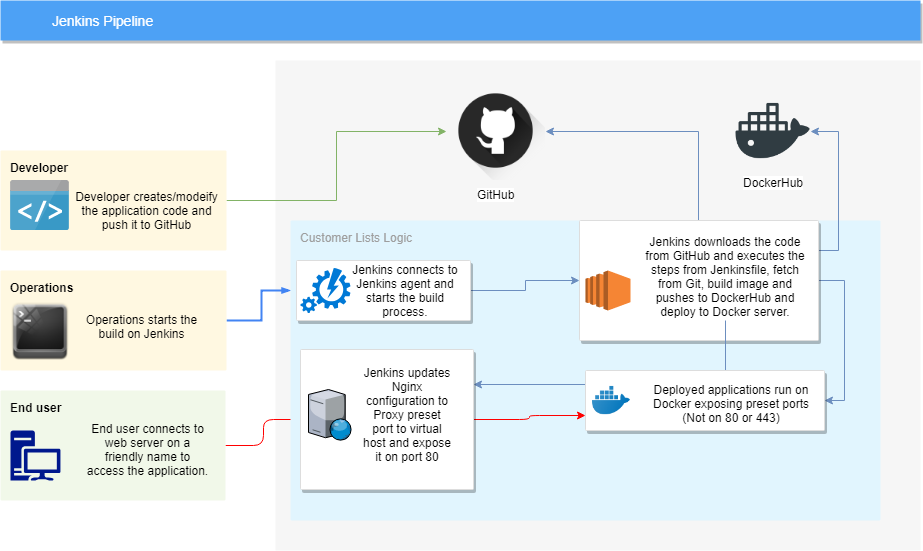

# **Best Buy Assignment*

## **Goals**

- Automate the deployment process to reduce human interaction and points of failure
- Deploy different applications based on its variables
- Test the application before deploying it to the server
- Create documentation explaining how it was done.

## **Decisions**

I decided to deploy the application to individual containers on Docker, to make it easier to scalated then on a further moment and make those images available on the repository, so it can be replicated in other environments.

The first ideia was to deploy on Kubernetes using HELM, however, small instances running on AWS/GCP didn't provide enough computing power for a Minikube installation.

That being said, I decided to deploy those container as standalone containers that would require less resources, considering I would still need more resources for the Jenkins.

The assignment description mentions we could trigger the build automatically or manually. It would be possible to trigger it automatically based on the Git Push and a Multi Branch pipeline, but I decided to parametize the procedure to make it more visual.

I had a small GCP Free instance that I planned to use as the single server, however, it lacked of memory to run both Jenkins and containers, therefore I used this instance just as a Jenkins server and created a new one on AWS as requested to run all the containers.

It would also be possible (and it actually will work) to use instance ports to access different deployments, but to make it more presentable I decided to setup an Nginx server as a reverse proxy and give the deployments FQDNs.

Most of the tests were firstly made using a local Virtual Machine on my workstation, to reduce the cost of instance running on cloud and for better performance (localhost, extra memory and CPU made testing easier).

## **Jenkins Workflow**

- The workflow is built on Jenkinsfile and consists of simple steps.
- In the first step, it will start the NodeJS application in the background and make a CURL request to the exposed port to make sure the server will start properly and return a 200 status code.
- If the check returns a 200 (OK) status code, it will pkill the NodeJS process and continue to the next step, else, it will pkill the process (or try, in case it failed to startup) and exit the pipeline.
- In the second step, considering the application itself is healthy, it will build the Docker image from a Dockerfile and push it to the Docker Hub repository with the TAG being the same as the build number, which is an incremental number and would avoid erasing older versions and preventing rollbacks.
- In the third step, it will update the nginx configs for the reverse proxy to pass the requests to the container port defined before building the deployment, so even if you want to deploy that environment to a different port, it will still be accessible from its FQDN.
- In the fourth and last step, it will stop and remove the previous container (if it existed) and create a new one from the new image uploded to the Docker Hub.

## **Reference**

The whole assignment was made consulting documentation from the internet and previous projects for reference.

- **NodeJS**
  - https://www.vultr.com/docs/installing-nodejs-and-express-on-centos
  - https://expressjs.com/en/starter/installing.html
- **Docker**
  - https://docs.docker.com/install/
- **GitHub**
  - https://github.com/nelsonfassis/bbycaSRE/commits/master
- **DockerHub Repo**
  - https://hub.docker.com/r/nelsonfassis/operations/

- **AWS Web Instance**
  - FQDN: aws.nelsonfassis.com, prod.nelsonfassis.com, test.nelsonfassis.com, dr.nelsonfassis.com, dev.nelsonfassis.com

- **GCP Jenkins Server**
  - FQDN: jenkins.nelsonfassis.com

## **Challenges**

- The first problem I encountered was to run the Jenkins server and NodeJS containers in the same instance f1-micro instance on GCP, that could not handle the load.

- I didn't have experience deploying NodeJS applications, which slowed me down making researches on what was needed and what should be the procedure to make it work.

- I am used to deploy the applications using Helm on the Jenkins agent that will install and deploy the applications on Kubernetes using Tiller, which skips some of the required configuration I had to do in this case.

- Writting the Jenkinsfile from scratch (also consulting foruns) took me longer than expected because of syntax errors.

- My initial idea involved a secondary pipeline with an Ansible playbook to deploy Nginx and setup its configuration files, but I decided to avoid unecessary overhead. Which wasn't a problem but since I was updating the configs quite often to test, it would've made things faster in the end.
